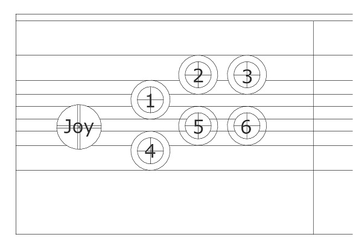

# Eigenes Spiel Hochladen

## Voraussetzungen

Sogenannte „shebang" an den Anfang der Script-Datei hinzufügen
(bestimmen mit welchem Programm das Spiel auszuführen ist)\
z.B. für Python: *\#!/usr/bin/env python3*

Die Auflösung des Arcade ist 1280x1024. Das Spiel muss die gleiche
Auflösung haben und/oder im Vollbildmodus starten.

Der Name der im Menü Angezeigt wird, ist der Name des Ordners, in dem
die Datei ist.

Nur ein Programm pro Ordner ist erlaubt. Wenn aus irgendwelchen Gründen
mehrere Ausführbare Dateien in einem Ordner sind kann man ein „\_" an
den Anfang des Namens schreiben und das Menü überspringt dieses. (z.B.
\_nichtausführen.py)

Beim Beenden des Programms muss sichergestellt werden, dass ggf. alle
Threads, Fenster, und Sounds richtig geschlossen werden. (z.B. für
PyGame: *pygame.quit())*

Das Programm muss aus dem Spiel heraus schließbar sein.

## Speicherort

Damit das Menü die Datei findet, muss diese in
/home/arcade/games/DEINSPIEL/SPIELDATEI.EXT Platziert werden. Bitte
stell sicher, dass nur eine ausführbare Datei in diesem Ordner ist. Wenn
eure Datei nicht als Ausführbare Datei gesehen wird, Informiert bitte
den Administrator, derzeit wird nur eine Begrenzte Anzahl an Endungen
erkannt.

Das Menü
zeigt Game-Icons an. Es sucht diese im gleichen Ordner, wie die
auszuführende Datei. Die Bilddatei muss dafür eine .ico Endung haben.

Das Menü kann zudem ein Screenshot des Spiels anzeigen, wenn dieses
ausgewählt ist. Die Bilddatei kann dafür .png oder .jpg sein.

## Steuerung

Das Control-panel simuliert ein Gamecontroller. Stellt sicher, dass euer
Programm solche Inputs unterstützt.\
Der Joystick gibt float Werte von -1 bis 1 je Achse an. Da die
Kalibrierung nicht immer perfekt ist, sollte die Abfrage schauen, ob der
Wert über 0,5 oder unter -0,5 ist.

## Joystick-unterstützung in Pygame

Pygame unterstützt Joysticks und Buttons.

### Initialisierung

### *joystick_list = \[pygame.joystick.Joystick(x) for x in range(pygame.joystick.get_count())\] joystick = joystick_list\[0\] joystick.init()*

### Abfrage

#### Joystick

Zur Abfrage ist die joystick.get_axis(axis) Funktion da.\
.get_axis(0) für x-Achse\
.get_axis(1) for y-Achse

Zum einfachen debuggen am PC ist es Ratsam auch Tastatur-Abfragen
ebenfalls zuzulassen. In diesem Fall wasd und Pfeil-Tasten

> pressed_keys = pygame.key.get_pressed()
>
> if pressed_keys\[pygame.K_a\] or pressed_keys\[pygame.K_LEFT\] or
> **joystick.get_axis(0) \< -0.5**:\
> \# links
>
> if pressed_keys\[pygame.K_d\] or pressed_keys\[pygame.K_RIGHT\] or
> **joystick.get_axis(0) \> 0.5**:\
> \# rechts
>
> if pressed_keys\[pygame.K_w\] or pressed_keys\[pygame.K_UP\] or
> **joystick.get_axis(1) \< -0.5**:\
> \# hoch
>
> if pressed_keys\[pygame.K_s\] or pressed_keys\[pygame.K_DOWN\] or
> **joystick.get_axis(1) \> 0.5**:\
> \# runter

#### Buttons

Buttons werden mit *joystick.get_button(*button*)* Abgefragtes gibt 6
haupt-Buttons, Abgefragt mit *get_button(0)* bis *get_button(5).
Beispiel:*

> if pressed_keys\[pygame.K_RETURN\] or **joystick.get_button(0)**:\
> \#doStuff...

## GameMenu debuggen

Der Sourcecode findet sich unter
<https://github.com/marilynias/Tisch-Arcade>.
